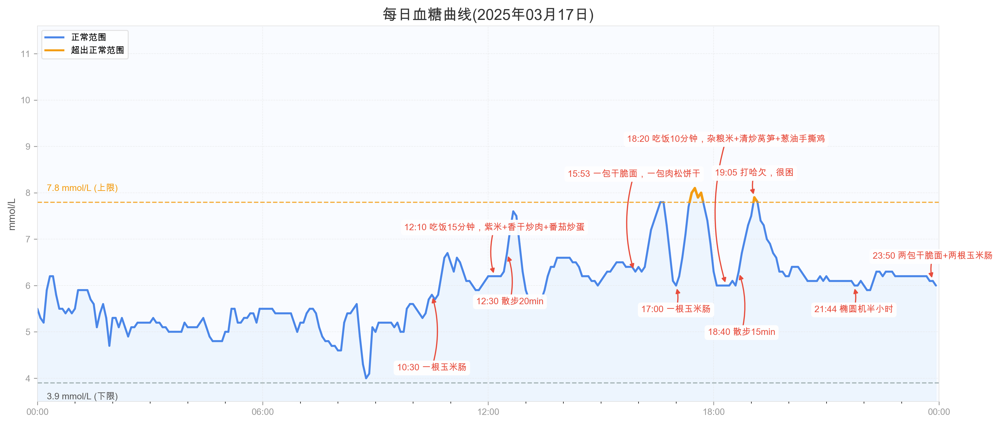

# 欧态血糖仪可视化

这是一个专为欧态血糖仪设计的数据可视化工具，能够将连续葡萄糖监测数据以及日常活动记录直观地展示在同一图表上，帮助您更好地理解血糖变化与日常活动的关系。

## 功能特点

- 从Excel文件中读取欧态血糖仪连续葡萄糖监测数据
- 在图表上标注各种活动（如饮食、运动等）
- 通过不同颜色直观区分正常与超标的血糖范围
- 显示血糖值的变化趋势与参考范围（3.9-7.8 mmol/L）
- 提供简洁、直观且美观的数据展示
- 支持从CSV文件加载自定义活动注释
- 支持命令行参数自定义图表生成
- 图像可存储在指定目录下

## 安装依赖

```bash
# 创建虚拟环境（推荐）
python -m venv venv
source venv/bin/activate  # Linux/Mac
# 或者 venv\Scripts\activate  # Windows

# 安装依赖包
pip install pandas matplotlib openpyxl
```

## 使用方法

### 基本用法

```bash
python visualizer.py
```

这将使用默认参数生成2025年3月17日的血糖曲线图。

### 命令行参数

```bash
python visualizer.py -d "2025/3/17" -f "OttaiCGM_04E3E5F13CE6.xlsx" -s -a "annotations.csv" --image-dir "charts"
```

参数说明：

- `-d, --date`：指定日期，支持多种日期格式，默认为"2025/3/17"
- `-f, --file`：Excel文件路径，默认为"OttaiCGM_04E3E5F13CE6.xlsx"
- `-o, --output`：输出图像文件名，默认为"血糖曲线_YYYY年MM月DD日.png"
- `-s, --show`：显示图表（不指定此参数则只保存图表而不显示）
- `-a, --annotations`：注释CSV文件路径，用于加载自定义活动注释
- `--create-sample`：创建示例注释CSV文件
- `--image-dir`：图像存储目录，默认为"images"

### 日期格式支持

支持的日期格式包括：
- YYYY/MM/DD（如2025/3/17）
- YYYY-MM-DD（如2025-3-17）
- YYYY.MM.DD（如2025.3.17）
- YYYY年MM月DD日（如2025年3月17日）
- MM/DD/YYYY（如3/17/2025）
- DD/MM/YYYY（如17/3/2025）
等多种格式

## 数据格式要求

### Excel文件格式

Excel文件应包含以下列：
- `时刻`：时间数据（可以是日期时间格式）
- `血糖值mmol/L`：血糖数值，单位为mmol/L

### 注释CSV文件格式

注释CSV文件应包含以下列：
1. `时间`：活动时间（HH:MM格式，如"12:30"）
2. `活动描述`：对活动的描述文本
3. `Y偏移量`（可选）：调整标注位置的偏移量（数字，如"-0.5"、"0.8"）
4. `日期(可选)`：指定注释适用的日期，用于在同一文件中存储多天的注释

示例CSV文件内容：
```
时间,活动描述,Y偏移量,日期(可选)
10:30,一根玉米肠,0,2025/3/17
12:10,吃饭15分钟，紫米+香干炒肉+番茄炒蛋,0.8,2025/3/17
12:30,散步20min,-0.8,2025/3/17
08:30,早餐：燕麦粥,0.5,2025/3/16
```

## 血糖参考范围

工具中使用的血糖参考范围：
- 正常范围：3.9-7.8 mmol/L
- 下限参考值：3.9 mmol/L
- 上限参考值：7.8 mmol/L

图表中使用不同颜色区分正常范围与超标范围的血糖值：
- 蓝色：正常范围内的血糖值
- 黄色：超出正常范围的血糖值

## 示例

生成特定日期的血糖曲线图：

```bash
python visualizer.py -d "2025-03-16"
```

指定输出文件名和目录：

```bash
python visualizer.py -d "2025/3/17" -o "my_glucose_chart.png" --image-dir "reports"
```

使用不同的数据文件并显示图表：

```bash
python visualizer.py -f "other_cgm_data.xlsx" -s
```

创建示例注释文件并使用它：

```bash
python visualizer.py --create-sample
```

指定自定义注释文件：

```bash
python visualizer.py -d "2025-03-16" -a "my_annotations.csv" -s
```

## 自定义注释

有两种方式添加自定义注释：

1. **使用CSV文件**：创建符合上述格式的CSV文件，然后使用`-a`参数指定
2. **修改代码**：修改代码中的`create_annotations`函数，添加预设的注释

可以通过`--create-sample`参数生成一个示例注释文件，作为创建自己的注释文件的参考。

## 预览



## 注意事项

- 箭头样式根据标注位置自动调整：标注在曲线上方时箭头向左凹，标注在曲线下方时箭头向右凹
- 标注位置经过智能算法优化，避免相互重叠
- 图表会自动处理血糖值穿过参考线(7.8 mmol/L)的情况，确保颜色正确变化